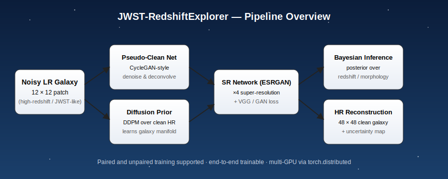
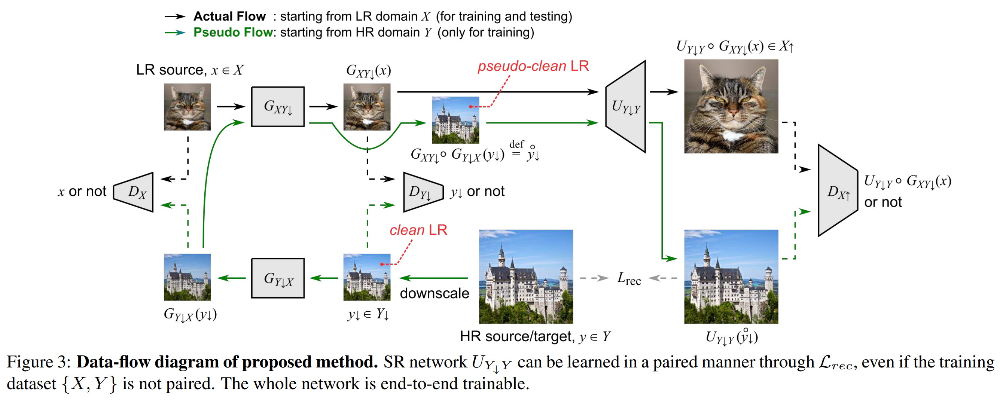

# JWST-RedshiftExplorer

> Super-resolution, denoising, and Bayesian analysis of **high-redshift galaxy images** inspired by the imaging regime of the James Webb Space Telescope (JWST).

<p align="center">
  
  <br/>
  <sub><em>Webb's First Deep Field — SMACS 0723. NASA, ESA, CSA, STScI · public domain (via Wikimedia Commons).</em></sub>
</p>

<p align="center">
  
</p>

---

## Overview

**JWST-RedshiftExplorer** combines deep generative models (diffusion + GAN) with classical Bayesian inference to recover **clean, high-resolution reconstructions of distant galaxies** from noisy, low-resolution observations.

The codebase implements an end-to-end pipeline that:

1. Learns a **pseudo-clean mapping** from noisy low-resolution (LR) inputs to clean LR images using a CycleGAN-style network (`models/pseudo_model.py`), enabling training even when paired clean/noisy data is unavailable.
2. Trains a **diffusion prior** (`models/galaxy_diffusion_model.py`, `models/denoising_diffusion_pytorch.py`) over the high-resolution (HR) galaxy manifold from datasets like Galaxy Zoo.
3. Performs **×4 super-resolution** with an ESRGAN-style network (`models/generators.py`, `models/rrdb.py`) using a combination of pixel, VGG perceptual, and adversarial losses.
4. Provides a route for **Bayesian inference** over reconstructed posteriors, supporting uncertainty-aware analysis of galaxy morphology and redshift.

The original method (paired/unpaired pseudo-clean flow) is summarized in the diagram below:

<p align="center">
  
</p>

---

## Repository Layout

```
configs/      # YAML experiment configs (GalaxyZoo, diffusion, NTIRE, weak-lensing, faces)
models/       # Generators, discriminators, diffusion, ESRGAN/RRDB/RCAN backbones, losses
tools/        # Dataset loaders and image utilities
train*.py     # Training entry points (GalaxyZoo, diffusion, NTIRE, weak-lensing)
test*.py      # Evaluation scripts
submit_*.sh   # Cluster submission scripts
misc/         # Figures used in this README
```

### Supported experiments

| Config | Task |
| --- | --- |
| `configs/GalaxyZoo.yaml` | ×4 SR on Galaxy Zoo (paired) |
| `configs/GalaxyZoo_diffusion.yaml` | Diffusion prior over HR galaxies |
| `configs/galaxy_unpaired.yaml` | Unpaired pseudo-clean training |
| `configs/galaxy_unpaired_12x12_splited.yaml` | Patch-split unpaired training |
| `configs/WeakLensing.yaml` | Weak-lensing image restoration |
| `configs/NTIRE.yaml` | NTIRE-style SR benchmark |
| `configs/faces.yaml` | Sanity check on FFHQ-like faces |

---

## Getting Started

### 1. Clone

```bash
git clone https://github.com/yihalem1/JWST-RedshiftExplorer.git
cd JWST-RedshiftExplorer
```

### 2. Environment

The code uses PyTorch with multi-GPU `torch.distributed` (NCCL backend) and `yacs` for config.

```bash
pip install torch torchvision yacs numpy pillow
```

### 3. Data

Point `DATA.FOLDER` in your chosen config to a directory containing the
`12X12/Noised`, `12X12/val_Noised_12X12`, `48X48/Resized`, and
`48X48/val_Resized_48X48` subfolders for the Galaxy Zoo experiments. See
`tools/pseudo_GalaxyZoo_data.py` for the exact expected layout.

### 4. Train

```bash
# Single- or multi-GPU is auto-detected from torch.cuda.device_count()
python train_galaxyZoo.py configs/GalaxyZoo.yaml
python train_galaxyZoo.py configs/GalaxyZoo_diffusion.yaml
python train_weak_lensing.py configs/WeakLensing.yaml
```

Or submit to a SLURM-style cluster:

```bash
sbatch submit_train.sh
```

### 5. Evaluate

```bash
python test_galaxyZoo.py configs/GalaxyZoo.yaml
```

---

## JWST Imagery — Targets that motivate this work

The figures below are real JWST observations of the kinds of objects this project aims to model and reconstruct: high-redshift galaxy fields, star-forming regions, interacting groups, planetary nebulae, and resolved spiral structure. All images are NASA/ESA/CSA releases hosted on Wikimedia Commons.

<table>
  <tr>
    <td align="center" width="50%">
      <a href="https://commons.wikimedia.org/wiki/File:NASA%E2%80%99s_Webb_Reveals_Cosmic_Cliffs,_Glittering_Landscape_of_Star_Birth_-_Flickr_-_James_Webb_Space_Telescope_(1).png">
        
      </a>
      <br/><sub>Carina Nebula — "Cosmic Cliffs" (NIRCam). CC BY 2.0.</sub>
    </td>
    <td align="center" width="50%">
      <a href="https://commons.wikimedia.org/wiki/File:Stephan%27s_Quintet_taken_by_James_Webb_Space_Telescope.jpg">
        
      </a>
      <br/><sub>Stephan's Quintet — compact galaxy group. Public domain.</sub>
    </td>
  </tr>
  <tr>
    <td align="center">
      <a href="https://commons.wikimedia.org/wiki/File:Southern_Ring_Nebula_by_Webb_Telescope_(2022).jpg">
        
      </a>
      <br/><sub>Southern Ring Nebula (NGC 3132). Public domain.</sub>
    </td>
    <td align="center">
      <a href="https://commons.wikimedia.org/wiki/File:Webb_revisits_the_Phantom_Galaxy_(NIRCam_and_MIRI_image)_(potm2406a).jpg">
        
      </a>
      <br/><sub>Phantom Galaxy (M74 / NGC 628) — NIRCam + MIRI. CC BY 4.0.</sub>
    </td>
  </tr>
</table>

---

## Results


<!--
<p align="center">
  
  
  
</p>
<p align="center"><em>Left: noisy 12×12 input · Center: reconstructed 48×48 · Right: ground truth.</em></p>
-->

---

## Applications

- **Astrophysics & Cosmology** — recovering morphology of faint, high-redshift sources.
- **Image Restoration Research** — a clean reference implementation of paired + unpaired SR with a diffusion prior.
- **Education & Outreach** — readable, configurable training scripts for ML-for-astronomy coursework.

---

## Citation

If this work is useful for your research, please cite the repository:

```bibtex
@software{jwst_redshift_explorer,
  author  = {Yihalem Yimolal},
  title   = {JWST-RedshiftExplorer},
  year    = {2022},
  url     = {https://github.com/yihalem1/JWST-RedshiftExplorer}
}
```

---

## License

Released for academic and research use. See repository settings for the exact license.

---

## Image Credits

All JWST imagery used in this README is courtesy of **NASA, ESA, CSA, STScI**, retrieved from Wikimedia Commons:

- [Webb's First Deep Field (SMACS 0723)](https://commons.wikimedia.org/wiki/File:Webb%27s_First_Deep_Field_(adjusted).jpg) — public domain
- [Carina Nebula "Cosmic Cliffs"](https://commons.wikimedia.org/wiki/File:NASA%E2%80%99s_Webb_Reveals_Cosmic_Cliffs,_Glittering_Landscape_of_Star_Birth_-_Flickr_-_James_Webb_Space_Telescope_(1).png) — CC BY 2.0
- [Stephan's Quintet](https://commons.wikimedia.org/wiki/File:Stephan%27s_Quintet_taken_by_James_Webb_Space_Telescope.jpg) — public domain
- [Southern Ring Nebula](https://commons.wikimedia.org/wiki/File:Southern_Ring_Nebula_by_Webb_Telescope_(2022).jpg) — public domain
- [Phantom Galaxy (M74)](https://commons.wikimedia.org/wiki/File:Webb_revisits_the_Phantom_Galaxy_(NIRCam_and_MIRI_image)_(potm2406a).jpg) — CC BY 4.0
